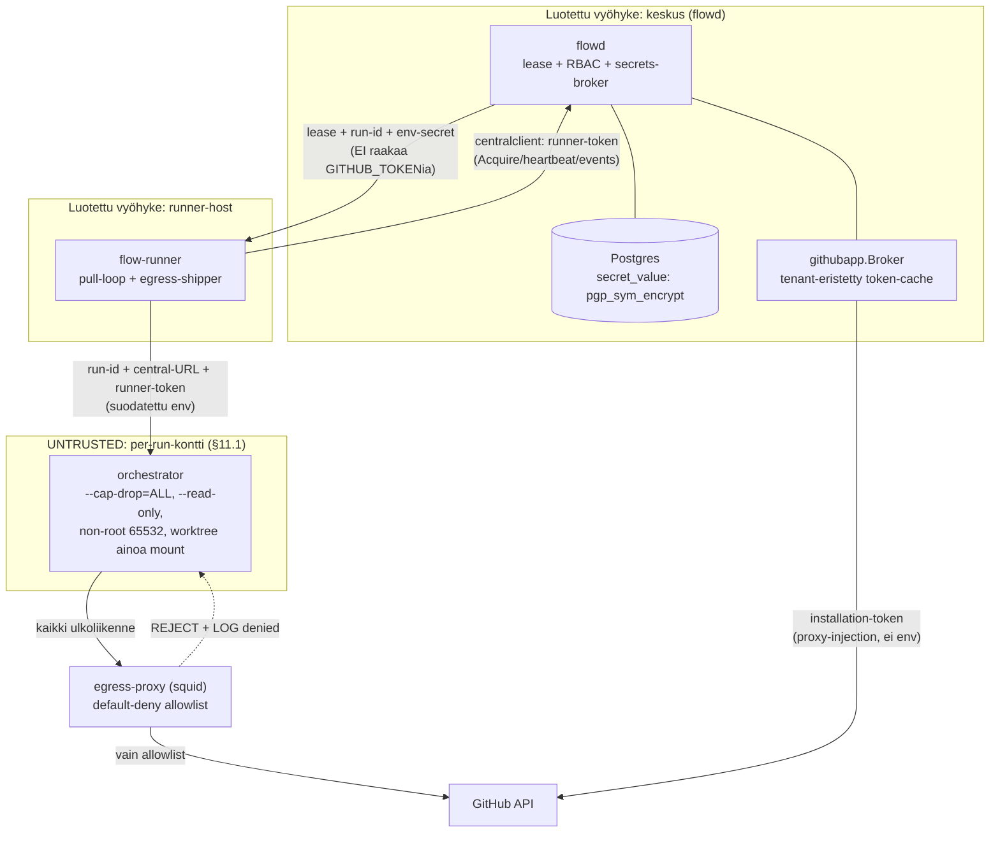

# Flow — arkkitehtuuri-, tarkoituksenmukaisuus- ja tietoturva-analyysi

> **Analyysipäivä** 2026-06-09 · **Repo-tila** commit `92f8d8c` (main) · **Laatija** GoodReason-analyysisykli · **Luonne** read-only-snapshot.

> **Disclaimer:** Tämä raportti viittaa olemassa oleviin issueihin (#34, #35, #36) eikä luo, sulje tai muokkaa niitä. Kanoninen suunnitelma on [`docs/flow-arkkitehtuuri.md`](flow-arkkitehtuuri.md); tämä raportti on tilannekuva, ei sen korvaaja.

---

## 1. Tiivistelmä

Flow-järjestelmä on **kypsempi kuin oma dokumentaationsa antaa ymmärtää.** `CLAUDE.md` kuvaa pakettiryhmät `internal/{auth,githubapp,secrets}` tyhjiksi "seameiksi" ja merkitsee Vaiheet 2–3 avoimiksi, mutta koodissa nämä on jo pääosin toteutettu, testattu ja mergetty maininiin. Analyysin keskeinen löydös ei ole tietoturva-aukko vaan **dokumentaation ja koodin desynkronoituminen** — sama luokka kuin tyypillinen "README on jäljessä" -velka, mutta täällä se koskee roadmappia, joka on uuden kehittäjän ensimmäinen kosketuspinta.

Kärkihavainnot:

- **Vaihe 2 (multi-tenancy/RBAC/auth) on pääosin toteutettu**, vaikka roadmap merkitsee sen avoimeksi: `internal/auth` on 6 go-tiedostoa, 1554 LOC ja 5 testitiedostoa (RequireRole, RequireAuth, capabilities, session, tenant, role). → [§3](#3-kypsyysanalyysi-dokumentaatio-vs-koodi)
- **Vaihe 3 (wizard + secrets-broker) on toteutettu**: `internal/secrets` 604 LOC (testattu), `cmd/flowctl/init.go` 416 riviä; issuet #9/#10/#11 mergetty. → [§3](#3-kypsyysanalyysi-dokumentaatio-vs-koodi)
- **Kaikki seitsemän arkkitehtuuri-invarianttia pidetään tai ovat tarkoituksella stub-tasolla** — yksikään ei ole rikki. Ainoa "stub by design" on yleinen tenant-resolvointi, joka odottaa Vaihetta 2. → [§5](#5-tietoturva-analyysi)
- **Ei kriittisiä eikä korkeita tietoturvalöydöksiä.** Keskitason löydökset ovat kattavuusaukko (`internal/centralclient` testaamaton) ja kaksi untracked-, ei-gitignoroitua tiedostoa julkisessa repossa. → [§5](#5-tietoturva-analyysi), [§7](#7-löydökset-ja-suositukset)
- **Roadmap (#35) on suurin onboarding-este**, koska se antaa uudelle kehittäjälle väärän kuvan järjestelmän kypsyydestä. → [§6](#6-tarkoituksenmukaisuusanalyysi)

**Kokonaisarvio:** Flow on rakenteellisesti terve, invarianttiensa puolesta kurinalainen ja toiminnallisesti pidemmällä kuin dokumentaationsa — suurin yksittäinen toimenpide on dokumentaation tahdistaminen koodin kanssa, ei koodin korjaaminen.

**Evidenssiluvut:** auth 1554 LOC + 5 testiä; githubapp 635 LOC (testattu); secrets 604 LOC (testattu); 19/20 `internal`-pakettia testattu (ainoa testaamaton: `internal/centralclient`, 343 LOC); build vihreä (Go 1.26.3); kaikki testit vihreitä, DB-testit ohittuvat ilman `FLOW_TEST_DSN`:ää suunnitellusti; issuet #6/#7/#9/#10/#11 mergetty.

---

## 2. Analyysin laajuus ja menetelmä

**Mitä analysoitiin ja miten.** Analyysi on staattinen, read-only-tilannekuva commitista `92f8d8c`. Käytetyt menetelmät:

- **Staattinen koodiluenta** kriittisiltä rajapinnoilta: lease, runnerexec, secrets, githubapp/broker, api, dashboard, egress-proxy, centralclient.
- **Git-loki**: mergetyt issue-haarat (`auto-run/issue-*`) ja niiden kytkös roadmappiin.
- **Testikattavuus**: pakettikohtainen testitiedostojen olemassaolo ja PORT-pakettien table-driven-fixturet.
- **Vertailu kahta totuuslähdettä vasten**: `docs/flow-arkkitehtuuri.md`:n invariantit (§2–§13) ja `CLAUDE.md`:n roadmap (§15-vaiheistus).

**Rajaukset.** Tämä raportti **ei** sisällä:

- penetraatiotestiä (ei aktiivista hyökkäyspintojen koettelua),
- kuormitus- tai suorituskykytestiä (ei lease-kilpailun stressitestiä todellisella konkurrenssilla),
- riippuvuusauditointia (ei `go mod`-puun CVE-tarkastusta).

**Sokeat pisteet (eksplisiittisesti).** `internal/secrets/`-hakemiston suora luku oli analyysiympäristössä permission-rajoitettu. Sisältö verifioitiin **epäsuorasti** rekursiivisella `grep`illä `internal/`-juuresta (rivinumerot ja tunnisteet poimittu suoraan tiedostosta, ei pääteltynä) — ks. [§5.3](#53-secrets). Tämä sokea piste **kavennettiin näin olennaisilta osin pois**: `IsForbiddenEnvKey`-listan sisältö, materialisointilogiikka ja kysely on verifioitu tiedostorivien tasolla. Avoimeksi jää vain ne secrets.go-rivit, joita ei kohdistettu grepillä (esim. tyyppimäärittelyt rivien välissä); ne eivät vaikuta tässä esitettyihin väitteisiin.

---

## 3. Kypsyysanalyysi: dokumentaatio vs. koodi

| Vaihe | Suunniteltu (CLAUDE.md/§15) | Toteutunut | Evidenssi |
|---|---|---|---|
| 0 — diagnostinen pohja | Valmis | Valmis | — |
| 1 — MVP-runko | Runko valmis | Valmis, langanpäät auki | #1/#2/#3 (milestone 1), #34 |
| 2 — multi-tenancy/RBAC/auth | Avoin | Pääosin toteutettu | auth 1554 LOC + 5 testiä; #6/#7 mergetty; `api/api.go:133-157` |
| 3 — wizard/secrets-broker | Avoin | Toteutettu | secrets 604 LOC; #9/#10/#11 mergetty; `init.go` 416 riviä |
| 4 — prwatch/viimeistely | Avoin | Avoin | #12/#13/#14/#22 |

**Selittävä teksti.** Vaiheet 0 ja 1 vastaavat dokumentaatiota. Poikkeama syntyy Vaiheissa 2 ja 3: `CLAUDE.md` esittää ne avoimina ja niiden pakettiryhmät tyhjinä, mutta git-loki ja koodi kertovat muuta. `internal/auth` on täysi RBAC- ja sessio-kerros (RequireRole, RequireAuth, capabilities, session, tenant, role), `internal/githubapp` toteuttaa JWT- ja App-broker-logiikan (635 LOC, testattu), ja `internal/secrets` on 604 LOC:n testattu paketti. Vastaavat issuet (#6, #7, #9, #10, #11) on mergetty `auto-run/issue-*`-haaroista. Repo on itse tiketöinyt ristiriidat: #35 (CLAUDE.md roadmap vanhentunut) ja #36 (README .env-polku).

**Tärkein nyanssi: kypsyys ei ole binäärinen.** "Vaihe 2 toteutettu" ei tarkoita, että kaikki tenant-mekaniikka olisi tuotantokovaa. RBAC- ja runner-token-polut ovat kytketty ja kovennettu (`api/api.go:123-157`), mutta **yleinen tenant-resolvointi on Vaihe 1 -stub tarkoituksella**: `auth/tenant.go:64-76` HeaderExtractor lukee `X-Flow-Tenant-ID`-headerin ja putoaa bootstrap-fallbackiin jos se puuttuu (71-74). Tämä on suunniteltu seam, ei keskeneräisyys — `WithTenant` (49-62) on vaihtopiste, jossa Vaihe 2 korvaa extractorin koskematta handlereihin.

**Onboarding-vaikutus.** Vanhentunut roadmap (#35) on suurin yksittäinen este uudelle kehittäjälle: se ohjaa rakentamaan jo olemassa olevaa ja antaa väärän mielikuvan järjestelmän tilasta. Tämä on dokumentaatiovelkaa, ei koodivelkaa. *(Huomautus: `CLAUDE.md`:n roadmap päivitettiin työhakemistossa tämän analyysin viimeistelyn aikana #35:n mukaisesti — yllä oleva väite koskee analysoitua commit-tilaa `92f8d8c`.)*

---

## 4. Arkkitehtuurianalyysi

**Rakennekuvaus.** Flow on kolmikerroksinen orkestraattori:

- **flowd (keskus)** — myöntää leasen, ajaa RBAC:n ja secrets-brokerin, omistaa Postgresin. Ainoa arbiter työnjaossa.
- **flow-runner (pull-loop)** — hakee työtä keskukselta `centralclient`-rajapinnan kautta, ajaa egress-shipperin. Luotettu host.
- **per-run-kontti (untrusted)** — orkestraattori ajaa agentin kovennetussa kontissa, jolla on minimaaliset oikeudet (§11.1).

Kriittinen rakennevalinta: **`centralclient` on ainoa paikka, jossa runner↔keskus-wire-shape määritellään** (`internal/centralclient/centralclient.go`). Tämä keskittää protokollan yhteen tiedostoon, mikä on vahvuus — mutta sama tiedosto on ainoa testaamaton `internal`-paketti (343 LOC), mikä on lievä rakennehuomio (ks. [§5](#5-tietoturva-analyysi)).

### Luottamusrajakaavio

**Vahvuudet.**

- **`centralclient` yksittäisenä rajapintana** — koko runner↔keskus-protokolla on yhdessä tiedostossa, mikä tekee wire-shape-muutoksista hallittavia ja estää protokollan hajaantumisen.
- **PORT/REWRITE-erottelu noudatettu** (CLAUDE.md §13) — PORT-paketeilla on bash-fixtureihin sidotut table-driven-testit, REWRITE-paketit ovat keskuskeskeisiä eivätkä kopioi bashin mekaniikkaa.
- **Middleware-pohjainen tenant-seam** — tenant-raja pakotetaan `WithTenant`-middlewaressa (`auth/tenant.go:49-62`), ei sovelluskoodissa, mikä on invariantin 4 mukaista.

**Lievät rakennehuomiot.**

- **CLI↔central prefix-listan käsin-synkka** — `flowctl init` torjuu token-prefixit jo CLI:ssä (`init.go:324-331`), mutta tämä lista on käsin-synkattava duplikaatti keskuksen `hasSecretLikePrefix`-tarkistuksen kanssa (`init.go:321-323`). Ei tietoturva-aukko (molemmat portit ovat olemassa), mutta divergenssiriski.
- **`centralclient` testaamaton kriittisellä rajalla** — wire-shape-määrittelyn tiedostolla ei ole testejä, vaikka se on protokollan ainoa lähde.

---

## 5. Tietoturva-analyysi

Invariantti-taso (status-arvot: **Pidetty** / **Stub (by design)** / **Osittain**):

| Invariantti | Koodiviite | Status |
|---|---|---|
| Lease fail-closed | `internal/lease/lease.go`; `centralclient.go:102-119` | Pidetty |
| Kontti: ei raakaa credentiaalia rajan yli | `runnerexec.go:82-101,119-124,146-153` | Pidetty |
| Secrets: ei plaintext-lokitusta | `api/secrets_handlers.go:117-120` | Pidetty |
| Dashboard XSS-turva | `dashboard/index.go` | Pidetty |
| Egress default-deny | `deploy/egress-proxy/init-firewall.sh:15-22,61,62` | Pidetty |
| Tenant-eristys (yleinen) | `auth/tenant.go:64-76` | Stub (by design, Vaihe 2) |
| Tenant-eristys (broker) | `githubapp/broker.go:91-93,101-103` | Pidetty |

> *Fail-closed* = vikatilanteessa järjestelmä menee suljettuun, turvalliseen tilaan (ei jaa työtä) sen sijaan että avautuisi. *Default-deny* = kaikki kielletään lähtökohtaisesti, ja vain nimenomaisesti sallittu päästetään läpi.

### 5.1 Lease fail-closed

Lease ei jaa uutta työtä ilman keskitettyä, transaktionaalista varausta: `internal/lease/lease.go` käyttää `FOR UPDATE SKIP LOCKED` -lukitusta ja erottaa `ErrNoWork`:n DB-virheestä — eli "ei töitä" ei koskaan sekoitu "keskus alhaalla" -tilaan. Olennaisinta: **ei `@me`-fallbackia**, joka toisi takaisin kaksi-arbiteria-ongelman (invariantti 1). Wire-puolella `centralclient.go:102-119` erottaa HTTP 204:n (ei töitä) muusta virheestä, jolloin fail-closed-semantiikka säilyy verkkorajan yli.

### 5.2 Kontti-kovennus

Per-run-kontti on §11.1:n mukaisesti minimioikeuksinen (`runnerexec.go:82-101`): `--user 65532:65532` (non-root), `--read-only`, `--cap-drop=ALL`, `--security-opt no-new-privileges`, sekä resurssirajat `--pids-limit`, `--memory`, `--cpus`. **Worktree on ainoa host-mount** (rivi 95), ja `HasForbiddenMounts` estää mm. `docker.sock`-mountin (146-153). Credentiaalien osalta: `GITHUB_TOKEN`/`GH_TOKEN` suodatetaan env:stä render-aikana (119-124, kutsuu `secrets.IsForbiddenEnvKey`), Claude-credentiaali annetaan read-only file-mounttina (128-130), ei env-muuttujana, ja `CentralToken` on flowd:n myöntämä runner-token — **ei GitHub-token** (36-41). Raaka credentiaali ei siis ylitä luottamusrajaa konttiin (invariantti 3).

### 5.3 Secrets

Salaus tapahtuu DB-puolella: `api/secrets_handlers.go:117-120` antaa `pgp_sym_encrypt`in INSERT-parametrina, jolloin plaintext ei kulje sovelluslokin kautta. Delivery-validointi (74-84): tuntematon delivery → 400; `delivery=env` + kielletty avain → 400 (§11.3-viittauksella). `delivery=proxy` hyväksytään skeematasolla, mutta runtime on toteuttamatta (48-51, 74) — sama langanpää kuin #34.

**Suora secrets.go-evidenssi (verifioitu epäsuoralla grepillä, ks. [§2](#2-analyysin-laajuus-ja-menetelmä)):**

- `IsForbiddenEnvKey` (`secrets/secrets.go:59-60`) on yksinkertainen map-lookup `forbiddenEnvKeys[key]` — **exact-match, ei case-normalisointia.** Lista (`secrets/secrets.go:51-54`) sisältää täsmälleen kaksi avainta: `GITHUB_TOKEN` ja `GH_TOKEN`. Kommentti (45-47) perustelee: keskus EI saa materialisoida näitä container-env:iin, koska `delivery='env'`-secret nimellä `GITHUB_TOKEN` ohittaisi muuten brokerin token-polun.
- `MaterializeEnv` (`secrets/secrets.go:188-201`): `delivery="proxy"` palauttaa `ErrDeliveryNotSupported` viittauksella egress-proxy-injektioon (§11.3, rivi 196); tuntematon delivery → sama virhe (198); kielletty avain (`IsForbiddenEnvKey(ref.Key)`, 200) → `ErrDeliveryNotSupported` "must use delivery=proxy" (201). Forbidden-tarkistus on siis kaksinkertainen — sekä HTTP-handlerissa että materialisointifunktiossa.
- `MaterializeAllEnvForTenant` (`secrets/secrets.go:223-254`): guardit nil-poolille (225), nil-registrylle (228) ja tyhjälle tenant_id:lle (231); kysely on tenant-rajattu `WHERE tenant_id = $1 AND delivery = 'env'` (236-237); dekryptaus `pgp_sym_decrypt` tapahtuu DB-puolella (124); tulos kerätään map-rakenteeseen `out[key] = value` (254). **Tenant-raja on siis pakotettu jo SQL-kyselytasolla**, ei pelkästään middlewaressa.

Testikattavuus on vahva: pgcrypto round-trip (`api/secrets_test.go:43-55`), kielletyt avaimet (84-101), RBAC-portti `CapSecretsManage` (106-118), 503 ilman avainta (158-171), 409 duplikaatti (139-152) ja regressiotesti, joka varmistaa ettei proxy-rivi vuoda env-mappiin (`TestLeaseAcquire_ProxyDeliveryDoesNotPoisonEnv`, 231-274).

### 5.4 GitHub App -broker

`githubapp/broker.go` eristää token-cachen tenanttikohtaisesti: cache-avain on `cacheKey(tenantID, installationID)` (91-93) ja lookup käyttää UNIQUE-rajoitetta `(tenant_id, org)` (141-146). `Token()` torjuu tyhjän `tenantID`:n (101-103), mikä estää tenant-rajan ohittamisen tyhjällä arvolla. Avainmateriaalia ei lokiteta (97-99, 159-161), ja cache-refresh tapahtuu 5 minuutin bufferilla ennen vanhenemista (25-29, 43-48). Broker-tason tenant-eristys on siis **pidetty**, toisin kuin yleinen tenant-resolvointi ([§5.7](#57-tenant-eristys)).

### 5.5 Dashboard XSS

`dashboard/index.go` rakentaa DOM:n yksinomaan `textContent`- ja DOM-node-rajapinnoilla, **ei `innerHTML`:llä**. Periaate on dokumentoitu riveillä 24-25. Tämä on invariantti 7:n mukaista: dynaaminen data ei voi injektoida HTML:ää, jolloin XSS-pinta sulkeutuu lähteessä eikä erillistä sanitointia tarvita.

### 5.6 Egress default-deny + shipper

Egress-proxy on default-deny: `deploy/egress-proxy/init-firewall.sh:15-22` rakentaa ipset-allowlistin (github.com, api.github.com, codeload, objects.githubusercontent.com, registry.npmjs.org, repo.packagist.org, api.anthropic.com), ja sääntöketju päättyy `REJECT`iin (62); estetty liikenne lokitetaan (`LOG`, 61). Egress-imagelle on dedikoitu build (commit `0494baf`), mikä varmistaa että firewall tosiasiassa ajetaan. Shipper minimoi telemetriaan vuotavan tiedon: `internal/egresship/parser.go:10-15` poimii vain timestampin, result-coden ja request-targetin — **ei bytejä, query-stringejä, credentiaaleja eikä client-IP:tä.**

### 5.7 Tenant-eristys

Tenant-eristys on **kaksitasoinen ja tilanteittain eri kypsyydessä**:

- **Skeema ja kyselyt:** `tenant_id` läpäisee tietomallin ja kyselyt (`api/handlers.go:80,100,356,440,459`) sekä secrets-materialisoinnin SQL:n ([§5.3](#53-secrets)). Tämä on pidetty.
- **Broker:** tenant-eristetty (ks. [§5.4](#54-github-app-broker)). Pidetty.
- **Yleinen resolvointi:** **stub by design.** `auth/tenant.go:64-76` HeaderExtractor lukee `X-Flow-Tenant-ID`:n ja putoaa bootstrap-fallbackiin jos header puuttuu (71-74). Tämä on Vaihe 1 -seam: `WithTenant` (49-62) on oikea vaihtopiste, jossa Vaihe 2 korvaa extractorin koskematta handlereihin (8-11, 64-68). Single-tenant-datassa tämä on turvallinen, mutta multi-tenant-käytössä se EI vielä eristä — se on suunniteltu täydennettäväksi Vaiheessa 2.

API-auth jakautuu kolmeen polkuun (`api/api.go:123-157`): `runnerAuth` (runner-token, 133-136), `rbacScoped` (session + RequireAuth + RequireRole, 146-150) ja `authedScoped` (154-157). Olennaista: **runner-token EI saa read-/dashboard-pääsyä** (123-132), mikä rajaa runnerin oikeudet vain työn hakemiseen ja telemetriaan.

### Yhteenveto vakavuusluokittain

- **Kriittinen:** ei yhtään.
- **Korkea:** ei yhtään.
- **Keskitaso:** `centralclient`-kattavuusaukko (testaamaton wire-shape-raja); kaksi untracked-, ei-gitignoroitua tiedostoa julkisessa repossa.
- **Matala:** CLI↔central prefix-listan käsin-synkattu duplikaatti; README .env-polun ristiriita (#36); vanhentunut roadmap (#35).

---

## 6. Tarkoituksenmukaisuusanalyysi

**Palveleeko toteutus päätavoitetta?** §2.1:n päätavoite on siirtymä yksittäiskäyttäjän bash-skriptistä monikäyttäjä-tiimituotteeksi: **nopea ja sujuva käyttöönotto tiimille + admin-näkyvyys.** Arvio on, että toteutus palvelee tätä tavoitetta hyvin — kriittiset kerrokset (RBAC, secrets-broker, kovennettu kontti, egress-allowlist, read-only dashboard) ovat paikoillaan.

**Wizard-UX on selkeä vahvuus.** `cmd/flowctl/init.go` (416 riviä) tarjoaa kaksi moodia: interaktiivinen (170-225) ja `--config flow.yaml` CI:lle (134-164). Happy path on hiottu — `detectOwnerRepoFromGit` päättelee owner/repon git-remotesta (371-379) niin ettei käyttäjän tarvitse syöttää sitä käsin. **Invariantti pakotetaan jo UX-tasolla:** `looksLikeSecretValue` torjuu token-prefixit (`ghp_`, `sk-`, `xoxb-` ym.) jo CLI:ssä (324-331, 312-316), jolloin käyttäjä ei vahingossa upota salaisuutta konfiguraatioon. Tämä on hyvää "secure by default" -suunnittelua.

**Langanpäät, jotka jäävät tavoitteen ja toteutuksen väliin:**

- `delivery=proxy`-runtime puuttuu (#34) — secret-broker hyväksyy proxy-deliveryn skeematasolla, mutta push-credentiaalin viimeinen maili (proxy-injektoitu push) on toteuttamatta.
- Avoimet Vaihe 4 -työt: #12 (prwatch), #13 (deploy + Tailscale), #14 (gVisor opt-in), #21 (audit-loki), #22 (metrics).

**Onboarding-kitka.** Kaksi dokumentaatio-ongelmaa hidastaa nimenomaan käyttöönottoa, joka on järjestelmän päätavoite: #36 (README ohjeistaa `cp .env.example .env` repo-juuressa, vaikka docker compose lukee `.env`:n `deploy/`-hakemistosta — `deploy/docker-compose.yml` käyttää `${POSTGRES_PASSWORD:?}`-interpolointia riveillä 17/37) ja #35 (roadmap antaa väärän kuvan kypsyydestä). Molemmat osuvat suoraan uuden käyttäjän ensimmäisiin minuutteihin.

**Roadmapin realistisuus.** Avoimet issuet ovat pieniä ja hyvin pilkottuja (#12/#13/#14/#21/#22 sekä langanpäät #34/#35/#36), mikä tekee jäljellä olevasta työstä ennustettavaa. Roadmap itsessään on realistinen — sen sisältö on vain jäljessä koodista.

---

## 7. Löydökset ja suositukset

Vakavuusasteikko: **Kriittinen (0 kpl)** / **Korkea (0 kpl)** / **Keskitaso** / **Matala** / **Vahvuus**.

| ID | Vakavuus | Havainto | Evidenssi | Issue | Luonne |
|---|---|---|---|---|---|
| F-1 | Keskitaso | `internal/centralclient` on ainoa testaamaton internal-paketti, vaikka se on runner↔keskus-wire-shapen ainoa lähde | `centralclient.go` (343 LOC), 0 testitiedostoa | — | löydös |
| F-2 | Keskitaso | Kaksi untracked-, EI-gitignoroitua tiedostoa julkisessa repossa → vahinko-commitin riski | `.enves` (4 t., roska), `deploy/docker-compose.override.yml` (port-remap 18080:8080, ei salaisuuksia) | — | löydös |
| F-3 | Matala | CLI:n secret-prefix-lista on käsin-synkattu duplikaatti keskuksen `hasSecretLikePrefix`-tarkistuksen kanssa → divergenssiriski | `init.go:321-323,324-331` | — | löydös |
| F-4 | Matala | README ohjeistaa `.env`:n repo-juureen, mutta compose lukee sen `deploy/`-hakemistosta | README:n .env-ohje vs. `deploy/docker-compose.yml:17,37` | #36 | löydös |
| F-5 | Matala | `CLAUDE.md`-roadmap on vanhentunut: Vaiheet 2–3 merkitty avoimiksi vaikka toteutettu | `CLAUDE.md` status-osio vs. `internal/{auth,githubapp,secrets}` | #35 | löydös |
| F-6 | Matala | `delivery=proxy`-runtime puuttuu: push-credentiaalin viimeinen maili toteuttamatta | `secrets/secrets.go:196`; `api/secrets_handlers.go:48-51,74` | #34 | löydös |
| F-7 | Matala | Yleinen tenant-resolvointi on stub by design; ei nimenomaisesti merkitty koodissa "Vaihe 2 täydentää" tasolla, joka estäisi väärinkäytön multi-tenant-oletuksessa | `auth/tenant.go:64-76` | — | löydös (dokumentointi) |
| S-1 | Vahvuus | Lease fail-closed ilman @me-fallbackia, ErrNoWork erotettu DB-virheestä | `lease/lease.go`; `centralclient.go:102-119` | — | vahvuus |
| S-2 | Vahvuus | Kontti-kovennus: ei raakaa credentiaalia rajan yli, minimioikeudet, worktree ainoa mount | `runnerexec.go:82-101,119-124,146-153` | — | vahvuus |
| S-3 | Vahvuus | Secrets: DB-puolen salaus, ei plaintext-lokitusta, kaksinkertainen forbidden-portti, tenant-rajattu kysely | `secrets/secrets.go:51-60,196-201,236-237`; `api/secrets_handlers.go:117-120` | — | vahvuus |
| S-4 | Vahvuus | GitHub App -broker: tenant-eristetty cache, tyhjän tenantID:n torjunta, ei avainlokitusta | `githubapp/broker.go:91-93,101-103,97-99` | — | vahvuus |
| S-5 | Vahvuus | Dashboard XSS-turva: yksinomaan textContent/DOM, ei innerHTML | `dashboard/index.go:24-25` | — | vahvuus |
| S-6 | Vahvuus | Egress default-deny -allowlist + REJECT + LOG; shipper ei vuoda credentiaaleja/IP:tä | `init-firewall.sh:15-22,61,62`; `egresship/parser.go:10-15` | — | vahvuus |
| S-7 | Vahvuus | PORT-pakettien table-driven-testit bash-fixtureilla tallella (käytös lukittu) | `gitremote_test.go:10`; `issue_test.go:13`; `prwatch_test.go:9-12` | — | vahvuus |
| S-8 | Vahvuus | Wizard secure-by-default: kaksi moodia, prefix-torjunta CLI:ssä, invariantti UX-tasolla | `init.go:134-164,170-225,312-331,371-379` | — | vahvuus |

**Eksplisiittinen rajaus.** Tämä raportti **ei sulje, korjaa eikä tiketöi** mitään löydöstä. Se on read-only-tilannekuva; toimenpiteet ja niiden priorisointi jäävät omistajalle. Issue-viittaukset osoittavat olemassa oleviin tiketteihin, eivät tämän raportin luomiin.

**Δψ — jatkoanalyysit (rajauksen ulkopuolella, ks. [§2](#2-analyysin-laajuus-ja-menetelmä)):**

- **Riippuvuusauditointi** — `go mod`-puun CVE-tarkastus (esim. `govulncheck`), ei tehty tässä.
- **Kuormitustesti** — lease-kilpailun stressitesti todellisella konkurrenssilla (`FOR UPDATE SKIP LOCKED` -käytös ruuhkassa).
- **Penetraatiotesti** — aktiivinen hyökkäyspintojen koettelu (kontin escape-yritykset, egress-bypass, tenant-rajan ohitus headerilla).
